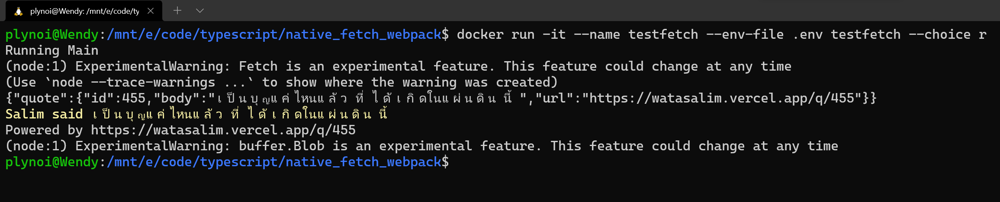

# Testing Node.js Native Fetch API - using TypeScript, Docker and Webpack
- version: 1.0
- Last update: Apr 2022
- Environment: Windows WSL
- Prerequisite: [Docker and Internet connection](#prerequisite)

## <a id="intro"></a>Introduction

The Node.js **native** [Fetch API](https://developer.mozilla.org/en-US/docs/Web/API/Fetch_API) i s now available as experimental feature in [Node v17.5](https://nodejs.org/en/blog/release/v17.5.0/). Developers do not need to install extra fetch packages anymore. Frontend Developers will be fimilar with the HTTP code in Node. 

To test this built-in API, you can run the native Fetch code with the ```--experimental-fetch``` when you run Node application as follow:

```
$> node app.js --experimental-fetch 
```

Since it is still an experimental feature, so it is adivisable to test it in a control environment such as Docker. This helps to avoid mess-up your local environment. 

## <a id="demo"></a>Demo Project

This demo project is a simple console application that requests an anonymous Far-right quote message from [@narze](https://twitter.com/narze)'s [Awesome Salim Quotes](https://watasalim.vercel.app/) application and API using the Node v17.50's native Fetch API. The application is written in [TypeScript](https://www.typescriptlang.org/), then compile and bundle to Node.js compatiable JavaScript with [Webpack](https://webpack.js.org/)

 

**Note**: This is just my simple project for learning TypeScript and it's ecosystem. Next project will be [Babel](https://babeljs.io/)/[RollUp](https://rollupjs.org/guide/en/) build 😉.

## <a id="single_vs_multi"></a>Single-Stage Build vs Multi-Stage Builds

## <a id="prerequisite"></a>Prerequisite
This demo project requires the following dependencies software.
1. Docker.
2. Internet connection.

## <a id="running"></a>Running the application.

The first step is to unzip or download the example project folder into a directory of your choice, then set up the project ```.env``` file based on your preference.

1. Start Docker
2. create a file name ```.env``` with the following content.
    ```
    BASE_URL=https://watasalim.vercel.app
    # Random API
    RANDOM_API_ENDPOINT=/api/quotes/random

    # Latest API
    LASTEST__API_ENDPOINT=/api/quotes/latest
    ```
3. Build a Docker image with the following command:
    ```
    $> docker build . -t testfetch
    ```
4. Run a Docker container with the following command: 
    ```
    $> docker run -it --name testfetch --env-file .env testfetch --choice <l || r>
    ```
5. To stop and delete a Docker container, run the following command:
    ```
    $> docker stop testfetch
    $> docker rm testfetch
    ```

## <a id="references"></a>References
For further details, please check out the following resources:
* [The Fetch API is finally coming to Node.js](https://blog.logrocket.com/fetch-api-node-js/) blog post.
* [Webpack: TypeScript](https://webpack.js.org/guides/typescript/) page.
* [TypeScript: Integrating with Build Tools](https://www.typescriptlang.org/docs/handbook/integrating-with-build-tools.html) page.